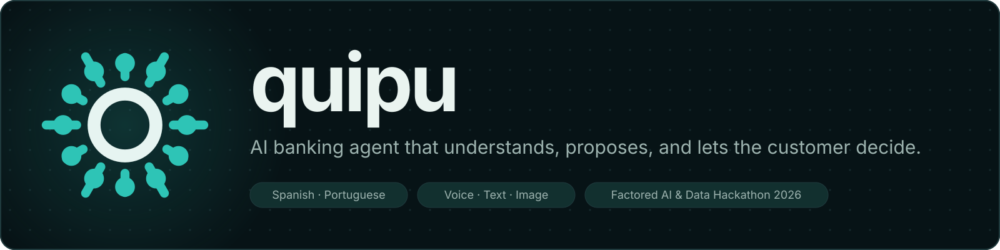

<p align="center">
  
</p>

# quipu

AI-first customer-service agent for a bank, built for the **Factored AI & Data Hackathon 2026**. A customer
talks to quipu by text or voice, in Spanish or Portuguese. It answers from the bank's own data and, when the
deployment allows it, it acts: blocks a card, opens a dispute, prepares a transfer. Four rules shape it:

1. **The model never does anything.** It understands and proposes. Code decides what is allowed, from the customer's data.
2. **Nothing is reported as done until it has been read back.** The card the customer sees is written by code from what was stored.
3. **Money moves only on the customer's button.** Transfers and payments wait for **Confirmar**. Refunds and account changes go to a person.
4. **It says how well it works.** The actions have their own evaluation, with held-out scenarios and a baseline.

## Architecture


- **Channels.** Next.js web app (chat, my finances, operator console) and a Telegram bot.
- **Backend.** FastAPI with a LangGraph agent: guard, router, one skill per intent, human handoff. Hexagonal layout.
- **Tools.** FastMCP servers, one per skill. They read the customer from the session and never take it as an argument.
- **Models.** Gemini on Vertex AI in the cloud, Ollama locally. Whisper for speech-to-text, Kokoro for text-to-speech.
- **Data.** Postgres: `core` (the organizer's data, loaded by the pipeline) and `ops` (actions, transfers, audit, conversations).
- **Observability.** Langfuse traces with masked content.

Details in [architecture.md](docs/documentation/technical/architecture.md) and the [ADRs](docs/documentation/technical/adr/).

## Features

| Feature | What it does | More |
|---|---|---|
| Balances and debts | Accounts, cards, due dates, minimum payments | [mcp/accounts.md](docs/documentation/technical/mcp/accounts.md) |
| Charge investigation | A charge the customer does not recognize, typed or from a photo of the statement. Finds duplicates, pending and foreign charges | [mcp/investigation.md](docs/documentation/technical/mcp/investigation.md) |
| Data lookup | Movements, spending, complaints, exchange rate. Guarded text-to-SQL for anything else, limited to the customer's own rows | [mcp/dwh.md](docs/documentation/technical/mcp/dwh.md), [evaluation.md](docs/documentation/technical/evaluation.md) |
| Khipear | Transfers, card payments and service bills. Prepared by the agent, executed only on the customer's confirmation | [ADR 0004](docs/documentation/technical/adr/0004-khipear-money-movement.md) |
| Actions | Block or cancel a card, open a payment inquiry, ask for a call, set an alert, email a summary. Propose, confirm, execute, verify, audit | [actions.md](docs/documentation/technical/actions.md) |
| Voice | Speak in Spanish or Portuguese; the answer can be read aloud | |
| Human handoff | Decided by code, no LLM call. The operator console takes over any chat | |
| Chat memory | The customer sees earlier conversations; the agent gets a code-written summary, never the raw messages | [chat_memory.md](docs/documentation/technical/chat_memory.md) |
| Evaluation | Held-out scenarios, blind, against the same agent without actions: correct end state 27% without, 100% with | [evaluation_actions.md](docs/documentation/technical/evaluation_actions.md) |

## Setup

You need [Docker Desktop](https://www.docker.com/products/docker-desktop/) and [Ollama](https://ollama.com) (`brew install ollama`). No API keys.

```bash
cp .env.example .env
make up
```

Open http://localhost:3000 and press **Hablar con Quipu**. `make up` starts the local LLM, Postgres with sample
data, the API on :8080 and the web on :3000, then checks that everything answers. Swagger: http://localhost:8080/docs.

Sign in as `demo-mx-duplicate@demo.bank` (the password is the same text), attach `web/public/casos/lucia-uber.png`
and write `no reconozco estas transacciones`. Every customer, question and statement image you can try is in
the [demo guide](docs/documentation/user/demo_guide.md).

**Flags in `.env`** that change what the demo does:

| Variable | Default | Effect |
|---|---|---|
| `LLM_PROVIDER` | `ollama` when `APP_ENV=local` | `google_genai` uses Gemini; set `GOOGLE_API_KEY` |
| `ACTIONS_ENABLED` | `false` | Turns on block card, inquiry, call, alert, email. Needs `app/adapters/outbound/postgres/migrations/001_actions.sql` |
| `KHIPU_ENABLED` | `true` | Transfers and payments |
| `CHAT_MEMORY_ENABLED` | `false` | Keeps conversations per customer |
| `DEMO_CUSTOMER_IDS` | demo list | IDs that can sign in; `*` allows any customer in the database |
| `OPERATOR_KEY` | | Opens the operator console at `/consola` |
| `TELEGRAM_BOT_TOKEN` | | Telegram bot; then `make telegram-local` |

**Without Docker** (needs [uv](https://docs.astral.sh/uv/) and Node 24+): `make setup`, `make demo-data`, then `make dev` and `make web` in two terminals.

## Commands

| Command | What it does |
|---|---|
| `make up` | Build and start everything, then smoke-test it |
| `make smoke` | Check API, database, LLM, web and one chat round-trip |
| `make logs` | Follow the logs of all services |
| `make down` | Stop everything, Ollama included. `V=1` also wipes the database |
| `make test` | Run the test suite (about 990 tests) |
| `make lint` | The CI lint. `make setup` installs it as a pre-commit hook |
| `make demo-data` | Postgres with the committed mini-set, from a fresh clone |
| `make data-lite` | Download the organizer's dataset (about 1.6 GB) |
| `make bronze` / `make silver SOURCE=full` / `make db-load SOURCE=full` | Full pipeline: raw CSV, Parquet, cleaned tables, Postgres |
| `make fixtures` | Regenerate the demo customers and their statement images |
| `make models` | Download the speech models for `make dev` (about 0.8 GB) |
| `make eval-latency URL=http://localhost:8080` | Time the frequent questions against a running API |
| `uv run python -m evals.actions.run --split heldout --repeats 3` | The held-out evaluation of the actions |
| `make diagrams` | Re-render the architecture and data model diagrams |

Every target, with a one-line description, is in the [Makefile](Makefile).

## Project structure

```
app/                     backend, hexagonal
  domain/                the rules: actions policy, risk signals, routing, texts, sql_scope
  application/           use cases; actions.py is the gateway: propose, confirm, execute, verify, audit
  adapters/
    inbound/agent/       LangGraph graph, AGENT.md (persona), skills/<name>/SKILL.md
    inbound/mcp/         FastMCP servers, one per skill (accounts, dwh, investigation, actions, transfers)
    outbound/postgres/   queries, schema.sql, migrations/
    outbound/            LLM factory, email templates
web/                     Next.js: app/ (chat, mis-finanzas, consola), components/, lib/, Dockerfile, nginx.conf
data_pipeline/           download, bronze, sample, silver, fixtures, load
data/sample/             committed mini-set of the organizer's data, plus the demo fixtures
evals/                   text_to_sql/ (deploy gate), actions/ (safety), latency/, chat_memory/
tests/                   pytest suite
docs/                    problem/, documentation/technical/ (architecture, ADRs, deploy, evaluation), documentation/user/
.github/workflows/       deploy.yml: lint and tests on every PR, deploy of both services on push to main
Dockerfile               the API image
docker-compose.yml       db, seed, app, web for local development
Makefile                 every command above
```

## Deploy

Production runs on **Google Cloud**: two Cloud Run services in `us-central1`, `factored-api` (FastAPI and the
agent) and `factored-web` (static Next.js on nginx), with **Cloud SQL** Postgres 16 and Gemini on **Vertex
AI**. GitHub Actions authenticates with Workload Identity Federation, so there are no keys in the repository.

**Every push to `main` deploys.** The workflow runs lint and tests, the text-to-SQL eval gate, then builds and
deploys both images tagged with the git SHA. Pull requests run lint and tests only.

One-time setup, done once per GCP project by an owner:

1. Enable Cloud Run, Cloud SQL, Artifact Registry, Cloud Build, Secret Manager and Vertex AI.
2. Create the Artifact Registry repository `factored` and the Cloud SQL instance with database and user `agent`.
3. Create the secrets: `factored-database-url`, `factored-db-password`, `jwt-secret`, `operator-key`, `langfuse-public-key`, `langfuse-secret-key`, `factored-smtp-password`.
4. Create the service account `factored-api` with `cloudsql.client`, `aiplatform.user` and `secretmanager.secretAccessor`, and the deployer account for GitHub with Workload Identity.
5. Load the data: `make db-proxy` in one terminal, `make etl-cloud CONFIRM=yes` in another. This replaces `core`, so tell the team first.

Set `GCP_ACCOUNT`, `GCP_PROJECT_ID` and `CLOUD_SQL_INSTANCE` in `.env` for the `make deploy*` and `make db-proxy`
targets. Do not deploy by hand while the workflow is active: the last deploy wins. The exact commands, the
eval gate, rollback and known limits are in [deploy.md](docs/documentation/technical/deploy.md).

## Documentation

- [User guide](docs/documentation/user/README.md) and [demo guide](docs/documentation/user/demo_guide.md)
- [Architecture](docs/documentation/technical/architecture.md), [ADRs](docs/documentation/technical/adr/), [MCP tools](docs/documentation/technical/mcp/README.md)
- [Actions](docs/documentation/technical/actions.md), [chat memory](docs/documentation/technical/chat_memory.md)
- [Evaluation of the actions](docs/documentation/technical/evaluation_actions.md), [text-to-SQL evaluation](docs/documentation/technical/evaluation.md), [raw results](docs/documentation/technical/evaluation_results/)
- [Data model](docs/documentation/technical/data/model.md) and [pipeline](docs/documentation/technical/data/pipeline.md)
- [Deploy](docs/documentation/technical/deploy.md)
- [Problem statement](docs/problem/) and [changelog](CHANGELOG.md)
