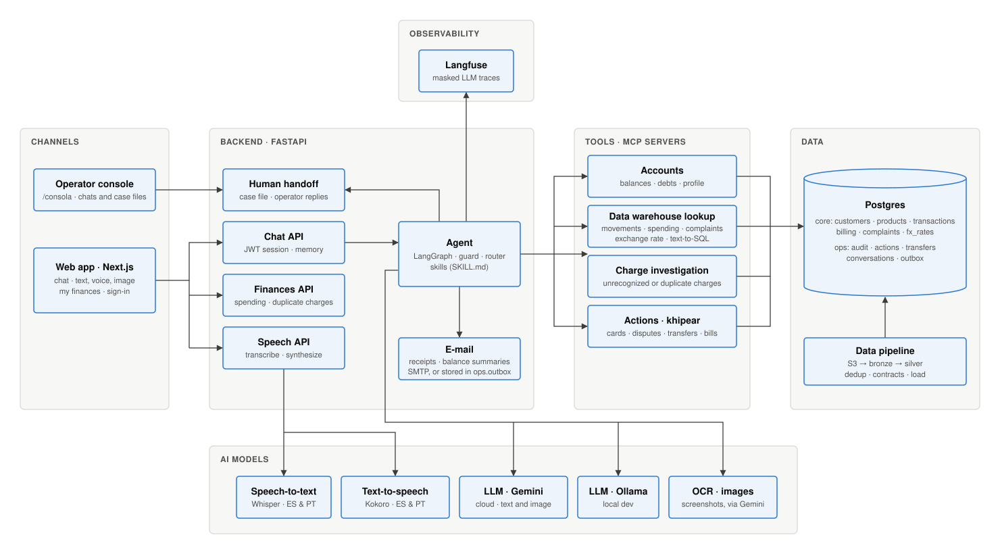
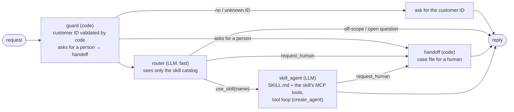

# Architecture

> Status: **draft**. This will be refined as components are built.

## Components



Solid boxes are **built**; dashed boxes are **planned**. The SVG is drawn by hand on a grid: edit [`diagrams/architecture.svg`](diagrams/architecture.svg), then regenerate the 300-dpi PNG with `make diagrams`.

## Guiding principle

**LLM where it helps, code where it must be guaranteed.** The model interprets language and writes replies. Deterministic code decides permissions, policy, and actions.

## The agent (implemented)

A LangGraph graph with deterministic nodes around one LLM node that uses **skills** and **MCP tools**.
Code: `app/adapters/inbound/agent/`.



- **Skills** are folders `agent/skills/<name>/SKILL.md` with frontmatter `name`, `description`
  and `mcp` (the MCP server that holds the skill's tools), plus instructions. The router sees
  only name and description; the body loads when the skill is used. Adding a skill means adding
  a folder and an MCP server; the graph does not change.
- **Persona and scope** live in `agent/AGENT.md`.
- **MCP tools** (FastMCP, `app/adapters/inbound/mcp/`) run in-process through `fastmcp.Client`.
  `agent/mcp_bridge.py` turns them into LangChain tools, so every call is traced.
- **Identity:** tools never take `customer_id` as an argument. The graph sends the session customer
  in the MCP request `_meta`, and tools read it with `session_customer(ctx)`. The LLM cannot see
  or change it. If the tools are ever served over HTTP, this becomes a bearer token read with `get_access_token()`, which is
  the MCP standard. At the HTTP edge the customer is the `sub` of a short-lived bearer JWT (see API authentication below); the UI gets that token from a **test identity service**, for synthetic data;
  step-up authentication is required before any money-moving skill.
- **Tracing:** Langfuse `CallbackHandler`, enabled when `LANGFUSE_*` keys are set (Cloud Run reads
  them from Secret Manager and sends to Langfuse Cloud). The session is `thread_id` and the user is
  `customer_id`, so Langfuse groups a customer's whole conversation. Traces are masked inside the
  API process before they are sent (the SDK's `mask` hook, `tracing.py`): long numbers (cards,
  accounts, documents, phones) keep only their last 4 digits, emails are removed and the personal
  columns of `core.customers` are redacted when they come as a named field. Known limit: a name
  written in free text, or returned by SQL under another column alias, is not detected.
- **Memory:** a LangGraph checkpointer keyed by `thread_id`. It is in-memory for now; the next
  step is a Postgres checkpointer.
- **API:** `POST /api/chat {message, thread_id?}` (bearer token required outside local) →
  `{reply, thread_id, customer_id, skill, tools_used, handoff}`.
- **Voice (web chat):** two open-source models on the API's CPU, loaded from `models/` on first use
  (`app/adapters/outbound/speech.py`). `POST /api/speech/transcribe` takes the recording as the
  request body and answers `{text, language}` with faster-whisper (`small`, int8).
  `POST /api/speech/synthesize {text, language}` answers a WAV read by Kokoro (`ef_dora` in
  Spanish, `pf_dora` in Brazilian Portuguese). Both need the same bearer token as the chat. The
  agent is not involved: the web sends the transcript through `POST /api/chat` like a typed
  message, so identity, handoff and tracing are the same for both. The voice is off on every page
  load until the customer presses **Activar voz del agente**; then replies to spoken messages are
  read aloud, in the language Whisper heard. That click is also what lets the page make sound:
  Safari refuses audio that does not start from a click, so the click opens a Web Audio context
  and every line plays through it. The web asks for the audio one line at a time, the next line
  while the current one plays, and writes the reply on screen at the pace of the voice: nothing is
  shown until the first line's audio is ready (about two seconds, "Generando la voz…"), then each
  line appears word by word while it sounds. Kokoro gives no word times, so
  `web/components/spoken.ts` estimates them from the line's known duration: a digit weighs 8
  letters, a spelled acronym 5 per letter, punctuation adds a pause. Those weights were fitted on
  15 real reply lines timed with Whisper and put word starts within 0.1 s on average (0.6 s with
  plain character counts). **Mostrar todo**, turning the voice off, the microphone or a new message
  put the rest of the text on screen at once. The agent does not stream: `/api/chat` still returns
  one complete reply. Both models are loaded when the API starts. Whisper runs with its silence
  filter, because a silent recording otherwise takes most of a minute. The audio is never stored.

## Component detail (original draft)

```
   ┌──────────── Chat UI (ES/PT) ────────────┐    ┌─ Human-agent console ─┐
   │ test login → session token (JWT)        │    │ handoff JSON + traces │
   └───────────────────┬─────────────────────┘    └──────────▲────────────┘
                       │                                     │
          ┌────────────▼─────────────┐                       │
          │ Orchestrator             │── handoff ────────────┘
          │ (deterministic state     │
          │  machine)                │
          └──┬──────────┬─────────┬──┘
   NLU       │          │         │   Response generation (LLM)
   (LLM /    │  Policy engine     │   grounded in verified facts,
   classifier)  (versioned rules  │   with citations
   intent,   │   in code)         │
   slots,    │          │         │
   language  │          │         │
          ┌──▼──────────▼─────────▼──┐
          │ Tool layer with authz    │  customer_id ALWAYS from the token,
          │ get_transactions,        │  never from the prompt · read-back
          │ create_dispute,          │  verification · bounded retries ·
          │ block_card, …            │  safe fallback
          │ over DuckDB / Postgres   │
          └────────────┬─────────────┘
                       │
   ┌───────────────────▼─────────────────────────────────────┐
   │ Data pipeline: S3 → bronze → silver → gold              │
   │ contracts (pandera), dedup, late arrivals, lineage,     │
   │ freshness policy                                        │
   └─────────────────────────────────────────────────────────┘
   Tracing (Langfuse / OpenTelemetry) on every step · execution logs = audit trail
```

## Key decisions (to become ADRs)

- **Permissions and policy stay out of the LLM.** The model proposes an intent and slots; code validates them and decides.
- **Confirm before acting, verify after acting.** Sensitive actions (create dispute, block card) require explicit customer confirmation. After the action, a read-back check confirms it happened before the system tells the customer.
- **Structural prompt-injection defense.** The LLM has no direct tool access and never sees or sets `customer_id`. Its outputs are validated against a schema.
- **Structured handoff payload:** `request`, `verified_facts`, `actions_taken`, `evidence` (transaction and policy IDs), `open_questions`, `language`, `priority`, `escalation_reason`.
- **Synthetic policy base:** dispute deadlines, amount thresholds, and requirements are documented and clearly **labeled as synthetic**.
- **Audit trail:** explanations come from sources, policy rules, and execution records, never from hidden chain-of-thought.

## The data warehouse lookups (implemented)

Three skills read the bank's data. In all of them the model proposes and code decides. Every tool, with its arguments and what it returns, is in [mcp/](mcp/README.md); the tables they read are in [data/model.md](data/model.md).

| Skill | What the model does | What code guarantees |
|---|---|---|
| `balance_inquiry` | Calls `get_balances`, `get_debts` or `get_profile` | Reviewed SQL. Totals are per currency; payment dates come labeled as team-generated |
| `charge_investigation` | Calls `investigate_charges` once: code finds the matching charges and investigates each | Reviewed SQL (duplicate, pending/reversed, FX). A failed lookup is `unavailable`, never "no" |
| `data_lookup` | Calls the tool that fits (`get_movements`, `get_spending_summary`, `get_complaints`, `get_exchange_rate`). Only when none fits, writes one `SELECT` and calls `run_sql` | Reviewed SQL for the tools. For `run_sql`: `app/domain/sql_scope.py` parses it, refuses anything but a read-only SELECT over the allowlisted `core` tables, and rewrites every customer table into a subquery filtered to the session customer. The database is a second wall: role `dwh_reader` (SELECT on `core` only), read-only transaction, 3 s timeout, 100 rows |

- The customer comes from the session (`session_customer(ctx)`), never from a tool argument, and
  never from the model. Tool calls are written to `ops.decision_log` (all but `search_transactions`
  and `describe_schema`).
- Unknown functions are refused by default: that is what stops `query_to_xml('select ...')`,
  which would run SQL from a string and skip the scoping.
- The scoping lives in the domain on purpose: it does not depend on Postgres features, so it
  carries over to another backend (DuckDB, a `.db` file) unchanged.
- Test it without an LLM: `POST /api/dev/dwh/sql {customer_id, sql}` (only when `APP_ENV=local`).
- Known limits: the scoping is one parser's view of the SQL (mitigated by executing the SQL the
  parser regenerated, not the original text); `customers` exposes the customer's own document
  number to a query; there is no RLS yet.

## API authentication (implemented)

Outside `APP_ENV=local`, `POST /api/chat` needs `Authorization: Bearer <jwt>`. The customer is the
token's `sub`, never the request body: no token gets 401 and a body `customer_id` that differs from the
token gets 403. Tokens are HS256, last 15 minutes and are signed with `JWT_SECRET` (the app refuses a
weak secret outside local). `POST /api/auth/token` is a **test identity service**: outside local it only
issues tokens for `DEMO_CUSTOMER_IDS`, so a visitor can be a demo customer and nobody else. In
production the bank's identity provider replaces it; `customer_from_token` is what stays. Conversations
are keyed `customer:thread`, so nobody can continue another customer's thread.
Code: `app/adapters/inbound/auth.py`, `http.py`. Tests: `tests/test_auth.py`.

## The customer's own finances (implemented)

`GET /api/me/finances?days=90` is what the "Mis finanzas" screen reads. The customer is the one the
bearer token proves (`customer_id` in the query is accepted only locally, like the chat's); a token
for another customer gets `403`. `days` goes from 7 to 365 and counts back from the dataset's last
transaction, like `get_spending_summary`, whose lookups it reuses (`app/application/spending.py`).
On top of them it adds the product and country, the duplicate charges and the largest purchase
(`app/adapters/outbound/postgres/finances.py`). The JSON is camelCase and has the shape of
`OwnFinances` in `web/lib/profile.ts`; a test pins the field names on both sides.

- **One currency.** The screen shows the currency the customer buys in most often, by number of
  purchases and never by amount. Spending in the others comes in `otherCurrencies` and is never
  added to the total.
- **Duplicate charges** follow the agent's own rule (`investigate_charge`): the same merchant,
  amount and currency within 10 minutes, Approved or Pending purchases, each pair once.
- **No comparison without history.** `totals.prevChangePct` is `null` when there was no spending in
  the period before, and the screen then leaves the comparison out. All eight demo customers are in
  that case: the demo data is shorter than two windows of 90 days.
- **All or nothing.** If any lookup fails the answer is `503 finances_unavailable`: a missing
  duplicate check would read as "no duplicate charges". A customer with no purchases in the period
  gets `404 no_spending_in_period`, and one who is not in the warehouse `404 unknown_customer`.
- **The sentences** (`notes`) are templates in `app/domain/finances.py`, not model output: they
  cannot invent a figure.
- **Nothing internal.** The staff console's `internal` block (segments, satisfaction, next action,
  history) is not part of this endpoint, and a test checks that it never appears. The operator's
  profile screen still shows sample figures until it has its own endpoint.
- **Not done.** The switch for duplicate-charge alerts keeps its state in the page. Saving it needs
  a table in `schema.sql`, and the deploy does not apply schema changes (see [deploy.md](deploy.md)).

## Operator console (implemented)

A person of the team opens `/consola` on the web with the shared `OPERATOR_KEY` and sees every chat of
the running instance: the full conversation, its status and, after a handoff, the case file.

| Status | Meaning | Who answers the customer |
|---|---|---|
| `bot` | Normal chat | The agent |
| `waiting` | The agent handed off | Nobody yet: the agent stays out |
| `human` | The operator replied | The operator, until they give the chat back |

- The operator's reply reaches the customer's chat because the web polls
  `GET /api/chat/{thread_id}/operator` every 3 seconds. The console polls `GET /api/crm/conversations`.
- While a chat is `waiting` or `human`, `POST /api/chat` stores the customer's message and returns
  `reply: null` without calling the agent.
- The chats are a mirror in the API's memory (`app/adapters/inbound/conversations.py`), not the
  database: they are lost when the instance stops. The agent does not see what the operator wrote.
- Telegram chats are not mirrored.

Code: `app/adapters/inbound/conversations.py`, `http.py`, `auth.py`, `web/app/consola/page.tsx`.
Tests: `tests/test_crm.py`.

## Reliability safeguards (implemented)

- **Routing safety net.** The LLM router decides first. If it picks no skill (prose, an empty reply or a
  permission question), `app/domain/routing.py` matches obvious Spanish and Portuguese requests and routes
  them in code. Text that looks like a tool call is never shown to the customer.
- **Model or tool outage.** The turn returns a safe message in both languages plus a handoff
  (`reason: assistant_error`), never a bare 500. Gemini calls use 2 retries and a 30 s timeout.
- **Configuration guard.** `app/config.py` refuses to start with `APP_ENV=local` on a remote database,
  with a cloud environment on a local one, or with a weak `JWT_SECRET` or `OPERATOR_KEY` outside local.

## Deployment (implemented)

Two Cloud Run services, `factored-api` (FastAPI + agent, root `Dockerfile`) and `factored-web` (static
Next.js on nginx, `web/Dockerfile`), Cloud SQL (Postgres 16) through the Cloud SQL connector, and Gemini on
Vertex AI. GitHub Actions tests and deploys on every push to `main`, authenticating with Workload
Identity Federation (no stored key). Runbook, rollback and limits: [deploy.md](deploy.md).
