# Data Model

The `core` schema the agent reads: eight tables, the same in the local Postgres and in Cloud SQL (only the amount of data differs). How the organizer's CSV files become these tables is in [pipeline.md](pipeline.md); the tools that read them are in [../mcp/](../mcp/README.md).

The same eight tables in the local Postgres and in Cloud SQL; only the amount of data differs. The diagram shows the columns the tools read (full definition: `app/adapters/outbound/postgres/schema.sql`). `fx_rates` has no foreign key: it is looked up by currency and date. Source: [`../diagrams/data_model.mmd`](../diagrams/data_model.mmd); regenerate the SVG and the 300-dpi PNG with `make diagrams`.

The brief asks to label every input. Each table carries its provenance as a `COMMENT ON TABLE` in `schema.sql`, and the load copies those labels into the quality report.

| Table | Rows are | Provenance |
|---|---|---|
| `customers`, `products`, `transactions`, `fx_rates`, `complaints` | the organizer's rows, only the columns the agent may use | organizer dataset (itself synthetic) |
| `app_sessions` | one row per app/web session | derived from the organizer's `digital_events` |
| `customer_service_summary` | one row per customer: contacts, escalations, open complaints, last CSAT | derived from the organizer's interactions, complaints and surveys |
| `billing` | one row per credit card and loan: statement date, due date, statement balance, minimum payment or installment, past-due amount | **team-generated** by a fixed rule (below) |
| `service_billers`, `service_bills` | the five services that can be paid (electricity, water, phone, internet, cable TV) and three pending bills for every customer with an active account | **team-defined** catalog; bills **team-generated** by a fixed rule in `load.py` (amount, due date and reference from a stable hash of the customer id). A bill the customer pays is marked `paid` by khipear until the next load |
| rows with `is_synthetic_fixture = true` | the 8 demo customers and their dispute scenarios, and the 2 khipear customers (`DEMO-MX-KHIPU` with two accounts, a card and a loan; `DEMO-MX-RECIBE`, who receives) | **team-generated** (`fixtures.py`) |
| movements whose `transaction_id` starts with `KHP-` | the two movements of each transfer or payment the customer confirmed | **written by the application** (khipear), gone at the next load |

Not loaded: `call_transcripts`, `call_center_interactions` and `satisfaction_surveys`. Their text is templates (every transcript still has `{monto}` placeholders) and the survey scores do not follow their own scales, so the agent only gets what the summary aggregates from them. `service_agents` and `branches` are not loaded either: no question uses them.

**The billing rule.** The dataset has balances, rates and `days_past_due`, but no due dates, statements or installments. `load.py` derives them, as of the dataset's last day (2026-06-18), from a stable hash of the product id, so the same product always gets the same figures:

- only cards and loans that are not Closed get a schedule (Blocked and Suspended ones still owe);
- a product that is past due was due exactly `days_past_due` days ago; any other is due 1 to 20 days ahead;
- the statement closes 20 days before the due date;
- a card's statement is its whole balance when past due, otherwise 70-100% of it; its minimum is 5% of the statement with a floor per currency, plus what is past due, never more than the statement;
- a loan's installment is the level payment for its balance, annual rate and remaining installments (6-60 personal, 60-360 mortgage).

The load refuses to run if a past-due product's due date disagrees with its `days_past_due`. The tools return these figures with `billing_provenance: team_generated` and the agent states them as illustrative.

## Design decisions

- **One `products` table for accounts, cards, loans, investments and insurance.** That is how the organizer ships it, and the tools filter by `product_type`. Splitting it would add tables without answering any new question.
- **`customer_id` is repeated on `transactions` and `billing`,** although it can be reached through `product_id` (in the source it agrees with the product's owner in every row). It is kept on purpose: every reviewed query filters by customer inside the SQL, and the guard for model-written SQL rewrites each customer-owned table into `WHERE customer_id = <session customer>` (`app/domain/sql_scope.py`). With the column on the table that isolation needs no join, so it cannot be forgotten in one.
- **No aggregate tables.** Over the 12-month window a customer has at most 56 transactions (median 10), so spending by category, by merchant or by month is computed on read through the `(customer_id, transaction_date)` index.
- **`fx_rates` has no foreign key.** It is reference data, looked up by currency and date.
- **Source relations that are broken are not modelled.** In the organizer's data a complaint's `affected_product_id` never belongs to the complaining customer, the products mentioned in a call almost never exist, and a customer's registration branch almost never matches a branch. No tool reads those columns.
- **`ops` is separate from `core`.** `core` is rebuilt by every load; `ops` is written by the agent and never reloaded: `ops.decision_log` (the audit trail), `ops.transfers` (khipear) and the tables of the action gateway ([actions.md](../actions.md)).
- **`products.account_number` exists only for savings and checking accounts.** It is the organizer's full `product_number`, kept so that a transfer can name the account that receives it. A card's or a loan's number is never loaded: those keep only `product_number_last4`.
- **Khipear is the one writer of `core`.** A confirmed transfer or payment changes `current_balance` on two products and adds two rows to `transactions`, in one database transaction ([ADR 0004](../adr/0004-khipear-money-movement.md)). `ops.transfers` holds the operation through its life: `proposed`, then `executed`, `cancelled`, `expired` or `blocked`. A load puts `core` back to the dataset's state and leaves `ops.transfers` as the trail.
- **A khipear movement is dated at the dataset's last moment, not today.** Every "last N days" counts back from `max(transaction_date)`; a movement dated today would empty those windows.
