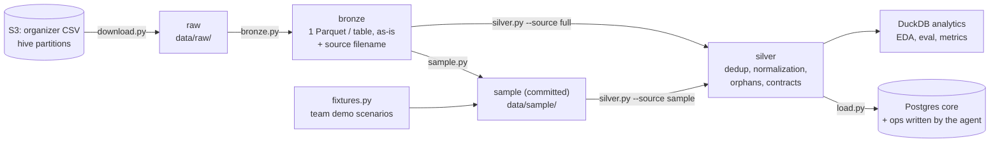

# Data Pipeline

How the organizer's CSV files become the agent's operational store. The same code runs on the committed mini-set (local, every teammate) and on the full dataset (Cloud SQL).

## Quick start

```bash
make up                      # local: Postgres + seed (mini-set -> silver -> Postgres) + agent API/web
make down                    # stop (make down V=1 also deletes the database volume)
make etl-cloud CONFIRM=yes   # Cloud SQL: raw CSV -> bronze -> silver -> core, full dataset (needs make db-proxy)
```

Local needs no S3 credentials: the mini-set is committed under `data/sample/`. The cloud ETL reads the CSV files in `data/raw/` (`make data-lite`).

| Environment | Data | Command |
|---|---|---|
| Local Postgres (tests, development) | mini-set of 1,500 customers + 8 team demo customers | `make demo-data` (or `make up`) |
| Cloud SQL (the deployed agent) | the full dataset with a 12-month history: 150,000 customers, 400,000 products, 1,481,223 transactions and 5,273,548 digital events (2025-06-18 to 2026-06-18) + the same 8 demo customers | `make etl-cloud CONFIRM=yes` |

## Layers



| Layer | Script | What it does |
|---|---|---|
| raw | `python -m data_pipeline.download` | Resumable S3 download that keeps the `year=/month=/day=` partitions |
| bronze | `python -m data_pipeline.bronze` | CSV → one Parquet per table. `union_by_name` absorbs schema evolution; the source `filename` is kept for lineage |
| sample | `python -m data_pipeline.sample` | Deterministic, referentially closed mini-set (see [11_data_model.md](../../../strategy_analysis_01/11_data_model.md)) |
| fixtures | `python -m data_pipeline.fixtures` | 8 team-made demo customers, labeled `is_synthetic_fixture` |
| silver | `python -m data_pipeline.silver --source sample\|full` | Deduplicates by primary key (latest `last_updated`), keeps the last 365 days of transactions and digital events (`HISTORY_DAYS`, counted back from the last transaction, so the load does not depend on how much was downloaded), normalizes country names, completes `transaction_category` from the merchant, drops rows whose customer doesn't exist, counts soft-FK orphans and source anomalies, validates pandera contracts, and writes `_quality_report.json` |
| serving | `python -m data_pipeline.load --source sample\|full` | Builds `core` from `schema.sql` as `core_staging`, bulk-loads silver + fixtures, generates `core.billing`, checks that every row arrived, then swaps it in for `core` in one transaction. `ops` is never touched. Idempotent |

`--source` in the load must match what silver was built from, so a stale `data/silver/` never puts the mini-set where the full dataset was meant. A load that fails halfway leaves the `core` the agent is reading untouched.

What ends up in `core`, table by table, and where each one comes from: [model.md](model.md).

## Data contracts and quality

- **Contracts** (pandera, in `silver.py`):
  - primary keys unique and not null;
  - closed vocabularies for the columns the tools branch on (`transaction_status`, `currency`).
- **Quality report:** `data/silver/_quality_report.json` records, per table, the input rows, dropped duplicates, dropped customer orphans, soft-FK orphans, counted anomalies and output rows; the load adds the target host, the rows that arrived in each `core` table and their provenance. It is the lineage evidence for each run. `make etl-cloud` copies the full-dataset report to [`quality_report_full.json`](quality_report_full.json) in this folder.
- **Known source issues:**
  - "Mexico" vs "México" in `transaction_country` (normalized);
  - `transaction_category` empty on purchases whose merchant has one (completed);
  - `customers.registration_branch_id` almost never matches `branches`;
  - products opened before their customer registered, balances over the limit, movements after the product expired (counted in the report, not fixed);
  - no MXN products: Mexican customers hold USD;
  - amounts are always positive (the type gives the direction) and balances do not reconcile with movements;
  - text fields are templates;
  - most "open" complaints are never closed: two thirds of them are over a year old. The tools and `customer_service_summary.open_complaints` count an open case older than 90 days (`STALE_AFTER_DAYS`) as stale, not open;
  - every "last N days" (spending, movements, charge search, stale complaints) counts back from the dataset's last transaction, the same day for every customer. The data is thin: only 17% of customers bought anything in the last 30 days, 37% in the last 90;
  - row counts are below the data dictionary, and the duplicates it announces are not in the files.

## Freshness and late arrivals (full ETL)

The source is partitioned daily by `process_date` and can arrive late.

- **Incremental rule:** reprocess the last *N* days of partitions on every run (N = 7 by default). Silver keeps one row per key by latest `last_updated`, so a late or corrected row replaces the earlier one.
- **Freshness target:** serving data at most 24 h behind the source. Document it as a policy; the hackathon data is static.
- **Update correctness:** because the supplied data is static, it is demonstrated with a labeled fixture that adds a late partition and a corrected row, then checks that silver keeps the new version. This is still to do.

## Running it as a scheduled job (not built)

Today the full ETL runs from a laptop through the Cloud SQL proxy (`make etl-cloud`). To schedule it:

| Now | Scheduled |
|---|---|
| `data/raw`, `data/bronze` on disk | GCS buckets `raw/`, `bronze/` (Parquet) |
| `bronze.py`, `silver.py --source full`, `load.py --source full` on a laptop | the same three commands in a Cloud Run job, triggered by Cloud Scheduler |
| database password read with `gcloud secrets` | the job's service account reads `factored-database-url` |
