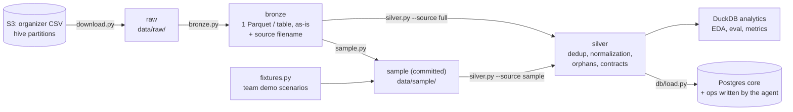

# Data Pipeline

How the organizer data becomes the agent's operational store. The same code runs on the committed mini-set (local, every teammate) and on the full dataset (GCP, the full ETL).

## Quick start

```bash
make up     # Postgres + seed (mini-set -> silver -> Postgres) + agent API/web on http://localhost:8080
make down   # stop (make down V=1 also deletes the database volume)
```

No S3 credentials are needed: the mini-set is committed under `data/sample/`.

## Layers



| Layer | Script | What it does |
|---|---|---|
| raw | `python -m data_pipeline.download` | Resumable S3 download that keeps the `year=/month=/day=` partitions |
| bronze | `python -m data_pipeline.bronze` | CSV → one Parquet per table. `union_by_name` absorbs schema evolution; the source `filename` is kept for lineage |
| sample | `python -m data_pipeline.sample` | Deterministic, referentially closed mini-set (see [11_data_model.md](../../strategy_analysis_01/11_data_model.md)) |
| fixtures | `python -m data_pipeline.fixtures` | 8 team-made demo customers, labeled `is_synthetic_fixture` |
| silver | `python -m data_pipeline.silver --source sample\|full` | Deduplicates by primary key (latest `last_updated`), normalizes country names, drops rows whose customer doesn't exist, counts soft-FK orphans, validates pandera contracts, and writes `_quality_report.json` |
| serving | `python -m data_pipeline.load` | Recreates Postgres `core` from `schema.sql` and bulk-loads silver + fixtures. `ops` is never touched. Idempotent |

## Data contracts and quality

- **Contracts** (pandera, in `silver.py`):
  - primary keys unique and not null;
  - closed vocabularies for the columns the tools branch on (`transaction_status`, `currency`).
- **Quality report:** `data/silver/_quality_report.json` records, per table, the input rows, dropped duplicates, dropped customer orphans, soft-FK orphans and output rows. It is the lineage evidence for each run.
- **Known source issues:**
  - "Mexico" vs "México" in `transaction_country`;
  - `customers.registration_branch_id` almost never matches `branches`;
  - text fields are templates;
  - row counts are below the data dictionary.

## Freshness and late arrivals (full ETL)

The source is partitioned daily by `process_date` and can arrive late.

- **Incremental rule:** reprocess the last *N* days of partitions on every run (N = 7 by default). Silver keeps one row per key by latest `last_updated`, so a late or corrected row replaces the earlier one.
- **Freshness target:** serving data at most 24 h behind the source. Document it as a policy; the hackathon data is static.
- **Update correctness:** because the supplied data is static, it is demonstrated with a labeled fixture that adds a late partition and a corrected row, then checks that silver keeps the new version. This is still to do.

## Scaling to the full dataset on GCP (full ETL)

| Local (mini-set) | GCP (full) |
|---|---|
| `data/raw`, `data/bronze` on disk | GCS buckets `raw/`, `bronze/` (Parquet) |
| DuckDB for silver and analytics | DuckDB on a Cloud Run job, or BigQuery external tables over GCS |
| `silver.py --source sample` | `silver.py --source full` (same code), scheduled with Cloud Scheduler |
| Postgres in docker compose | Cloud SQL for Postgres; `db/load.py` points to it via `DATABASE_URL` |
| `make up` | Cloud Run services (agent API/web) + a Cloud Run job for the seed/load |

**What changes for the full load:**
- a time window for `core.transactions` (e.g. the last 180 days);
- `COPY` batching for large tables;
- secrets in Secret Manager instead of `.env`.
