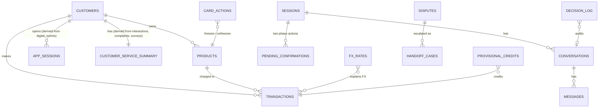

# Data Model for RASTRO

> Date: 2026-09-27. Status: **implemented on the mini-set** (`make up`).
> Related: [10_proposal.md](10_proposal.md) · pipeline details in [data_pipeline.md](../documentation/technical/data_pipeline.md).

## 1. What the data told us (measured on the organizer data)

Measured on the downloaded subset (transactions Oct-2025 → Jun-2026, 1.06M rows):

| Check | Result | Consequence |
|---|---|---|
| Transactions per customer in 90 days | median **3**, p90 6, p99 10, max 20 | For real customers, finding the charge is usually trivial |
| Near-duplicate charges (same customer, merchant and amount within 10 min) | **0** | The "it was our error" scenario doesn't occur in the organizer data |
| Duplicate primary keys | 0 in every table we checked | The announced ~2% duplicates don't appear in this subset |
| Transaction status | Approved 92%, Declined 5%, **Pending 2%**, **Reversed 1%** | Real material for the "pending" and "reversed" cases |
| Complaint and transcript text | template text (see EDA 01) | No real conversations |
| `transaction_country` | mixes "Mexico" and "México" | Silver normalizes it |
| `customers.registration_branch_id` | only 5 of 150,000 match a branch | A synthetic-generator orphan; it is counted in the quality report and doesn't block anything |

**Decision:** RASTRO's scenarios are demonstrated with **8 team-made demo customers** (fixtures), labeled `is_synthetic_fixture = true`. They sit on top of a real, referentially closed sample of the organizer data. The brief allows this: *"sandbox services and mock banking tools are acceptable when their contracts and limitations are documented"*, and *"demonstrate … with a clearly labeled test fixture"*.

## 2. Two stores, two jobs

| Store | Holds | Used for |
|---|---|---|
| **DuckDB over Parquet** (raw → bronze → silver) | Every table, including interactions, transcripts, complaints and surveys | EDA, baseline, metrics, evaluation |
| **Postgres** (`core` + `ops`) | Only what the agent's tools read or write, with indexed per-customer lookups | The running agent |

We don't load everything into Postgres. The agent never scans 10M events or 5M transactions. Keeping the analytics data out of the serving store keeps startup and deploys fast.

## 3. Schema

- **`core`** (reloaded from silver on every `make up`): `customers`, `products` (card number masked to the last 4 digits), `transactions`, `fx_rates`, `app_sessions`, `customer_service_summary`.
- **`ops`** (written only by the agent's tools, never reloaded): `sessions`, `pending_confirmations`, `card_actions`, `provisional_credits` (with a unique `idempotency_key`), `disputes`, `handoff_cases` (a JSONB case file), `conversations`, `messages`, `decision_log`.
- **Source of truth:** [`app/adapters/outbound/postgres/schema.sql`](../../app/adapters/outbound/postgres/schema.sql).

## 4. Tool → table map

| Skill / tool (see 10 §0) | Reads | Writes |
|---|---|---|
| Session and identity | `ops.sessions` | `ops.sessions` |
| `search_transactions`, `rank_candidates` | `core.transactions` (the session's customer, last 90 days) | `ops.decision_log` |
| `check_duplicate`, `check_pending` | `core.transactions` | `ops.decision_log` |
| `check_fx` | `core.transactions`, `core.fx_rates` | `ops.decision_log` |
| `freeze_card`, `unfreeze_card` | `core.products`, `ops.card_actions` | `ops.pending_confirmations`, `ops.card_actions` |
| `propose_provisional_credit` | `core.transactions`, `ops.provisional_credits` | `ops.pending_confirmations`, `ops.provisional_credits` |
| `open_dispute`, `get_case_status` | `ops.disputes` | `ops.disputes` |
| `create_human_case` | `core.customer_service_summary`, `core.app_sessions`, everything above | `ops.handoff_cases` |
| "Claim conflicts with app evidence" heuristic | `core.app_sessions` | — |
| Conversation resume | `ops.conversations`, `ops.messages` | same |

## 5. The mini-set (committed, 1.6 MB)

Built by `python -m data_pipeline.sample` from the organizer data:
- **Window:** 2026-04-01 → 2026-06-18, the same for every table.
- **Customers:** 1,500, stratified by country × segment. Priority goes to customers present in several tables. At least 40 are guaranteed per scenario (pending, reversed, declined, fraud, "Cargo no reconocido", foreign currency).
- **Closure:** every row of those customers in every table, plus the agents, branches and FX rates those rows reference.

| Table | Rows |
|---|---|
| customers | 1,500 |
| products | 8,518 |
| transactions | 13,703 |
| digital_events | 10,238 |
| call_center_interactions / call_transcripts | 686 / 172 |
| complaints / satisfaction_surveys | 242 / 336 |
| service_agents / branches / FX rates | 599 / 350 / 936 |

**Fixtures** (`data/sample/fixtures/`, produced by `python -m data_pipeline.fixtures`): 8 demo customers with ~30 purchases each over 90 days, plus the scenario charges.

| Demo customer | Scenario |
|---|---|
| `DEMO-MX-DUPLICATE` | Uber charged twice, 4 s apart → bank error |
| `DEMO-CO-PENDING` | Amazon purchase still pending → likely to release |
| `DEMO-MX-FX` | Purchase at a US store → FX explanation |
| `DEMO-AR-FRAUD` | 3 high-amount purchases in another city → human |
| `DEMO-CO-AMBIGUOUS` | 4 charges on the same day → clarifying question |
| `DEMO-MX-OWN-PURCHASE` | Charge made from the customer's own app session → evidence conflict |
| `DEMO-AR-REVERSED` | Charge already reversed → explain |
| `DEMO-BR-PORTUGUESE` | Portuguese-speaking customer, duplicate charge → PT flow |

**Tests:** `tests/test_sample.py` checks every customer foreign key, the time window, transcript ↔ interaction links, cross-table coverage, scenario coverage, the fixtures, and the size budget.

## 6. Open point

The repo is **private** today, and the submission must be public. The sample is synthetic organizer data, with fake names, emails and phones. Confirm that redistribution is allowed before making the repo public. If it isn't, remove `data/sample/*.parquet` from the public history and keep `make sample`.
